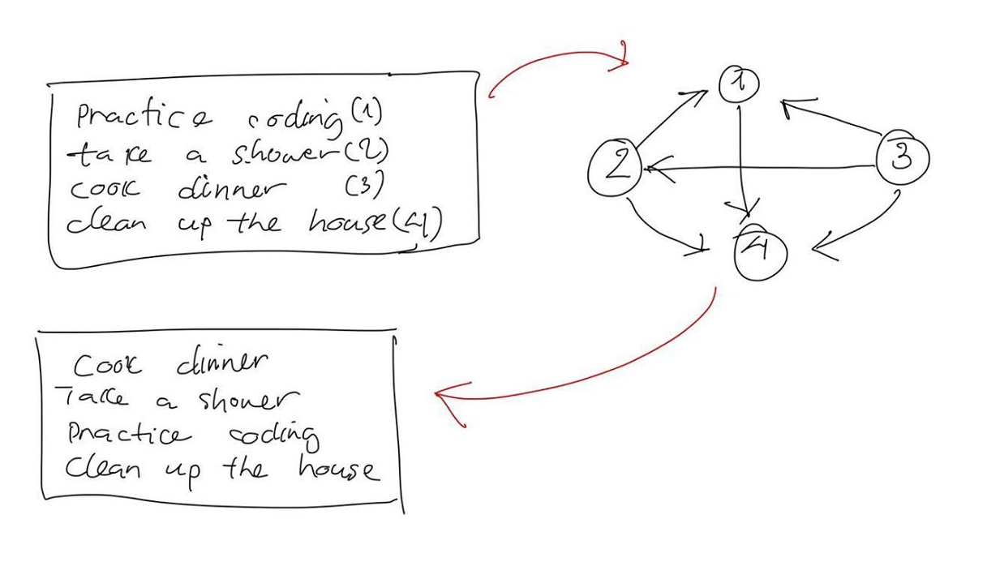

# tksort
[](https://travis-ci.org/hoang-khoi/tksort)

A simple task prioritizer works on a simple algorithm. Here how it works:
1. Dump your tasks to a text file, for example `personal_tasks.txt`
2. Execute `tksort personal_tasks.txt`, the application now asks you for the priority of **each** pair of tasks.
3. Answer the questions with `1` or `2` or anything else if you're not sure about it.
4. Once all done, `personal_tasks.txt` will be updated with the prioritized task list.

## Demo

[](https://asciinema.org/a/RsZC8XSs7FbseEOFu0Jaa5Uuk)

## Installation
Build prerequisites:
* `CMake >= 3.12`
* `make`
```bash
./install.sh
```

It builds the application and then copy the binary to `/usr/local/bin/` which will require sudo privilege.